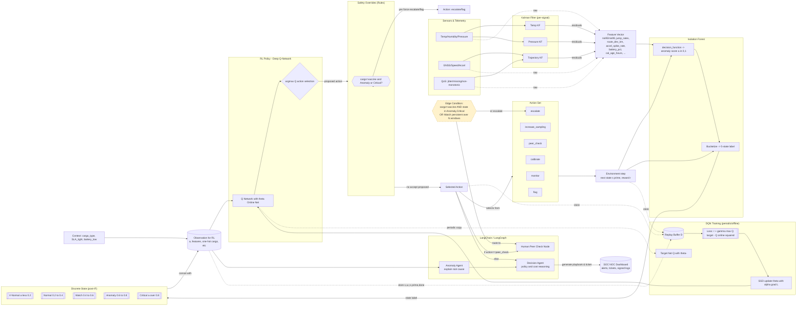

```mermaid
flowchart LR
  %% ===== Sensing & Preprocess =====
  subgraph SENSE["Sensors & Telemetry"]
    T[Temp/Humidity/Pressure]
    G[GNSS/Speed/Accel]
    QL[QoS: jitter/missing/non-monotonic]
  end

  subgraph KF["Kalman Filter (per-signal)"]
    KF_T[Temp KF]
    KF_P[Pressure KF]
    KF_G[Trajectory KF]
  end

  T --> KF_T
  T --> KF_P
  G --> KF_G
  QL --> KF_G
  T -.raw.-> FEAT
  G -.raw.-> FEAT
  QL -.raw.-> FEAT

  KF_T -->|residuals| FEAT[Feature Vector\nnis95/nis99, jump_rates,\nroute_dev_km, accel_spike_rate,\nbattery_pct, cal_age_hours, ...]
  KF_P -->|residuals| FEAT
  KF_G -->|residuals| FEAT

  %% ===== Isolation Forest =====
  subgraph IF["Isolation Forest"]
    IF_S[decision_function -> anomaly score a in 0,1]
    IF_B[Bucketize -> 5-state label]
  end
  FEAT --> IF_S --> IF_B

  %% ===== States after IF =====
  subgraph STATES["Discrete State (post-IF)"]
    V1[[V-Normal a less 0.2]]
    V2[[Normal 0.2 to 0.4]]
    V3[[Watch 0.4 to 0.6]]
    V4[[Anomaly 0.6 to 0.8]]
    V5[[Critical a over 0.8]]
  end
  IF_B -->|state label| STATES

  %% ===== Context in State =====
  CTX[Context: cargo_type, SLA_tight, battery_low]
  STATES -->|concat with| OBS[(Observation for RL<br/>a, features, one-hot cargo, etc)]
  CTX --> OBS

  %% ===== DQN Inference Path =====
  subgraph DQN["RL Policy - Deep Q-Network"]
    QNET[Q Network with theta Online Net]
    QACT{argmax Q action selection}
  end
  OBS --> QNET --> QACT

  %% ===== Safety Layer & Actions =====
  subgraph SAFETY["Safety Overrides (Rules)"]
    RULE1{{cargo=vaccine and Anomaly or Critical?}}
  end
  QACT -->|proposed action| SAFETY
  SAFETY --> RULE1
  RULE1 -->|yes force escalate/flag| A_ESC[Action: escalate/flag]
  SAFETY -->|no accept proposed| A_SEL[Selected Action]

  %% ===== Action Set =====
  subgraph ACTIONS["Action Set"]
    A_MON[monitor]
    A_INC[increase_sampling]
    A_PEER[peer_check]
    A_CAL[calibrate]
    A_ESC2[escalate]
    A_FLAG[flag]
  end
  A_SEL -->|selects from| ACTIONS

  %% ===== LangChain / LangGraph Orchestration =====
  subgraph AGENTS["LangChain / LangGraph"]
    DETECT[Anomaly Agent<br/>explain root cause]
    DECIDE[Decision Agent<br/>policy and cost reasoning]
    HIL[Human Peer Check Node]
  end

  %% Conditional routing for Peer Check
  A_SEL -->|if action==peer_check| HIL
  A_SEL -->|else| DECIDE
  OBS --> DETECT
  DETECT --> DECIDE
  DECIDE -->|generate playbook & ticket| OUT[(SOC NOC Dashboard<br/>alerts, tickets, signed logs)]

  %% ===== Explicit Conditional Edge Example =====
  %% LangGraph edge condition combining cargo & bucket
  CEDGE{{Edge Condition:<br/>cargo=vaccine AND state in Anomaly,Critical<br/>OR Watch persistent over N windows}}:::cond
  CEDGE -->|route to| HIL
  CEDGE -->|or escalate| A_ESC2

  %% ===== Environment Transition =====
  ACTIONS --> ENV[Environment step<br/>next state s prime, reward r]
  ENV --> IF_S
  ENV --> IF_B

  %% ===== DQN Training Loop (offline/online) =====
  subgraph TRAIN["DQN Training (periodic/offline)"]
    EXP[(Replay Buffer D)]
    TGT[Target Net Q with theta-]
    LOSS[[Loss: r + gamma max Q target - Q online squared]]
    UPD[SGD update theta with alpha grad L]
  end
  OBS -.store s,a,r,s prime,done.-> EXP
  A_SEL -.store.-> EXP
  ENV -.store.-> EXP
  EXP --> LOSS --> UPD --> QNET
  QNET -.periodic copy.-> TGT

  %% ===== Style Definitions =====
  classDef cond fill:#fff2cc,stroke:#d6b656,stroke-width:2px,stroke-dasharray: 5 5

```