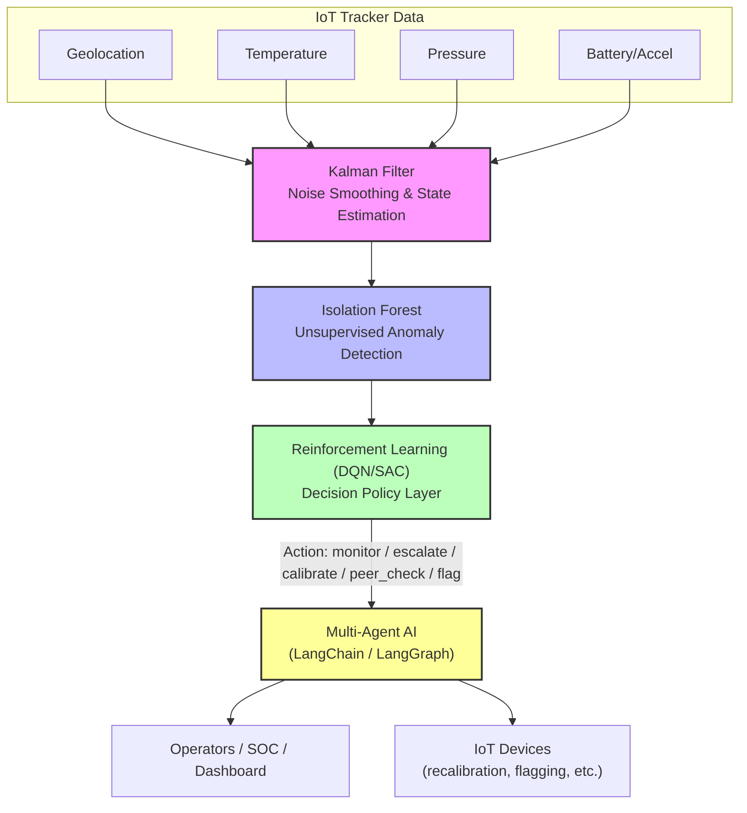

```mermaid
flowchart TD
    subgraph Data["IoT Tracker Data"]
        A1[Geolocation] 
        A2[Temperature]
        A3[Pressure]
        A4[Battery/Accel]
    end

    A1 & A2 & A3 & A4 --> KF[Kalman Filter\nNoise Smoothing & State Estimation]

    KF --> IF[Isolation Forest\nUnsupervised Anomaly Detection]

    IF --> RL["Reinforcement Learning (DQN/SAC)\nDecision Policy Layer"]

    RL -->|Action: monitor / escalate / calibrate / peer_check / flag| Agent["Multi-Agent AI\n(LangChain / LangGraph)"]

    Agent --> Ops[Operators / SOC / Dashboard]
    Agent --> Devices["IoT Devices\n(recalibration, flagging, etc.)"]

    style KF fill:#f9f,stroke:#333,stroke-width:2px
    style IF fill:#bbf,stroke:#333,stroke-width:2px
    style RL fill:#bfb,stroke:#333,stroke-width:2px
    style Agent fill:#ff9,stroke:#333,stroke-width:2px

```