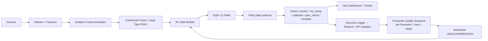

```mermaid

flowchart LR
  A[Sensors] --> B[Kalman + Features]
  B --> C[Isolation Forest Anomalies]
  C --> D[Contextual Fusion: Cargo Type ONLY]
  D --> E[RL State Builder]
  F[Forwarder Quality Snapshot<br/> per forwarder × lane × cargo ] --> G[Bucketizer UNK/LOW/MED/HIGH]
  G --> E
  E --> H[DQN / Q-Table]
  H --> I[Policy Bias  optional ]
  I --> J[Action: monitor / inc_samp / calibrate / peer_check / escalate]
  J --> K[Ops Dashboard + Tickets]
  J --> L[Outcome Logger → Reward + KPI Updates]
  L --> F


```