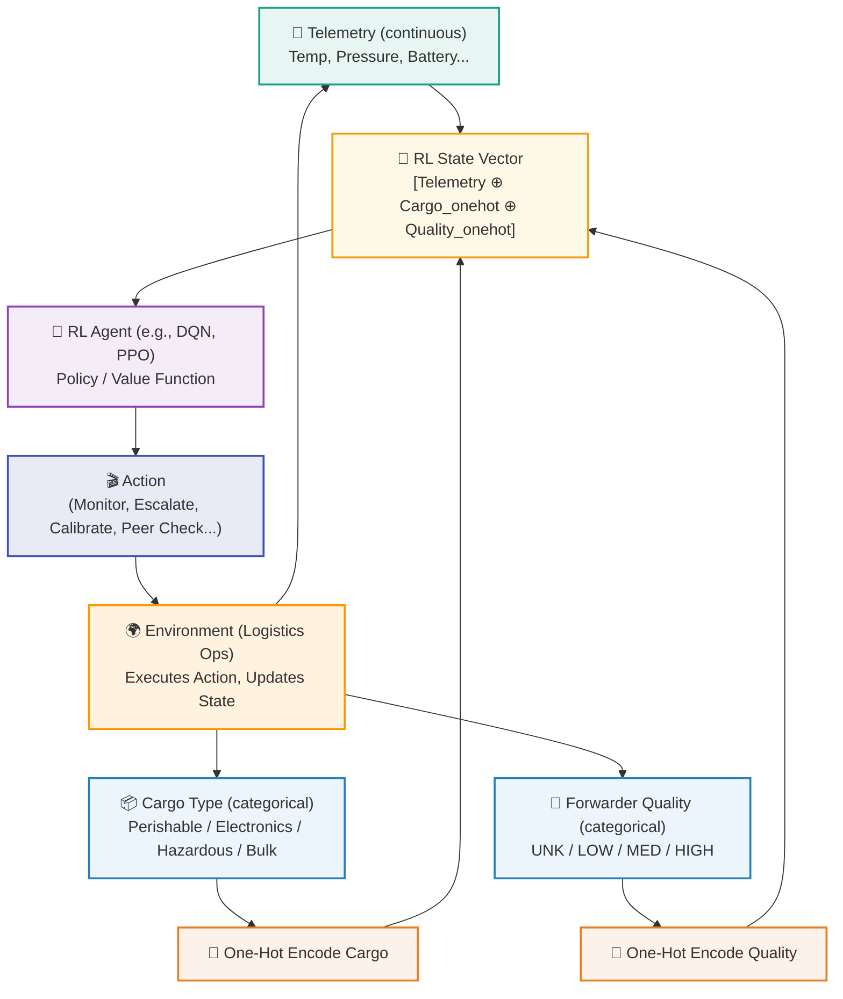

```mermaid
flowchart TD

%% Step 1: Inputs
SENSORS["📡 Telemetry (continuous)<br/>Temp, Pressure, Battery..."]:::sensor
CARGO["📦 Cargo Type (categorical)<br/>Perishable / Electronics / Hazardous / Bulk"]:::context
FWD["🚚 Forwarder Quality (categorical)<br/>UNK / LOW / MED / HIGH"]:::context

%% Step 2: Encoding
ENCODE_C["🔢 One-Hot Encode Cargo"]:::encode
ENCODE_F["🔢 One-Hot Encode Quality"]:::encode

CARGO --> ENCODE_C
FWD --> ENCODE_F

%% Step 3: State Vector
STATE["🧩 RL State Vector<br/>[Telemetry ⊕ Cargo_onehot ⊕ Quality_onehot]"]:::state

SENSORS --> STATE
ENCODE_C --> STATE
ENCODE_F --> STATE

%% Step 4: RL Agent
AGENT["🤖 RL Agent (e.g., DQN, PPO)<br/>Policy / Value Function"]:::agent

STATE --> AGENT

%% Step 5: Action
ACTION["🎬 Action<br/>(Monitor, Escalate, Calibrate, Peer Check...)"]:::action

AGENT --> ACTION

%% Step 6: Environment
ENV["🌍 Environment (Logistics Ops)<br/>Executes Action, Updates State"]:::env
ACTION --> ENV
ENV --> SENSORS
ENV --> CARGO
ENV --> FWD

%% Style
classDef sensor fill:#E8F6F3,stroke:#16A085,stroke-width:2px
classDef context fill:#EBF5FB,stroke:#2980B9,stroke-width:2px
classDef encode fill:#FDF2E9,stroke:#E67E22,stroke-width:2px
classDef state fill:#FEF9E7,stroke:#F39C12,stroke-width:2px
classDef agent fill:#F4ECF7,stroke:#8E44AD,stroke-width:2px
classDef action fill:#E8EAF6,stroke:#3F51B5,stroke-width:2px
classDef env fill:#FFF3E0,stroke:#FF9800,stroke-width:2px


```