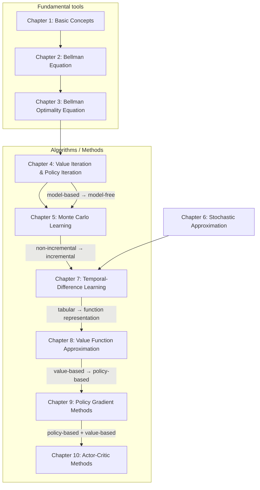

```mermaid
flowchart TD
  %% Groups
  subgraph FUND["Fundamental tools"]
    C1["Chapter 1: Basic Concepts"]:::base
    C2["Chapter 2: Bellman Equation"]:::base
    C3["Chapter 3: Bellman Optimality Equation"]:::base
  end

  subgraph ALG["Algorithms / Methods"]
    C4["Chapter 4: Value Iteration & Policy Iteration"]:::highlight
    C5["Chapter 5: Monte Carlo Learning"]:::base
    C7["Chapter 7: Temporal-Difference Learning"]:::base
    C8["Chapter 8: Value Function Approximation"]:::base
    C9["Chapter 9: Policy Gradient Methods"]:::base
    C10["Chapter 10: Actor-Critic Methods"]:::base
  end

  C6["Chapter 6: Stochastic Approximation"]:::base

  %% Flows (roughly matching the figure)
  C1 --> C2 --> C3 --> C4 --> C5
  C5 -- "non-incremental → incremental" --> C7
  C6 --> C7
  C7 -- "tabular → function representation" --> C8
  C8 -- "value-based → policy-based" --> C9
  C9 -- "policy-based + value-based" --> C10

  %% Alternate/top ribbon note from C4 to C5 (model-based → model-free)
  C4 -- "model-based → model-free" --> C5

 

```